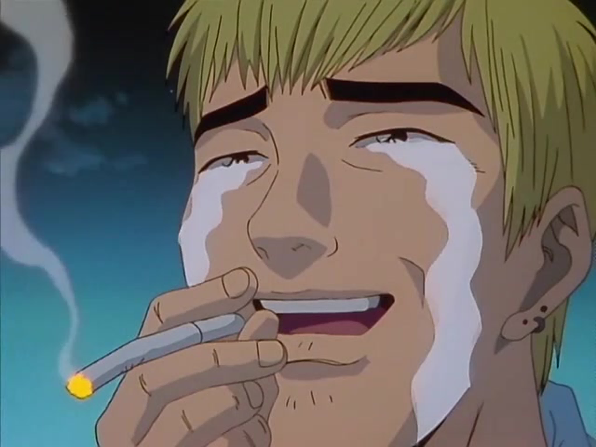

# Lomanov Aleksandr 
[](https://www.youtube.com/watch?v=o6YeFTwehBg&list=PLjECPJrdKj24zzZOfmD8RQfHIq78HAUUZ)

## Contacts
Address: Moscow, Russia<br/>
Git: [laleks6](https://github.com/laleks6)<br/>
Discord: laleks#0503<br/>
Telegram: @laleks6<br/>

## About me
My name is Sasha. I am a frontend student. I graduated from the National University of Science and Technology "MISIS" with a degree in mining engineering. I was born in Kazakhstan but now i live in Moscow.
P.S. For the third time I'm trying to pass stage-1, but something is not going according to plan.<br/>
P.P.S Is this some kind of joke???


## Skills

**Basic level:**
* Html
* CSS
* Javascript
* Figma

## Code example
```
function fakeBin(x){
  return x.split('').map((num) => num < 5 ? 0 : 1).join('')
}
```
## Education
National University of Science and Technology MISiS

## Languages
  Russian - **native**<br/>
  English - **A1-A2**<br/>
